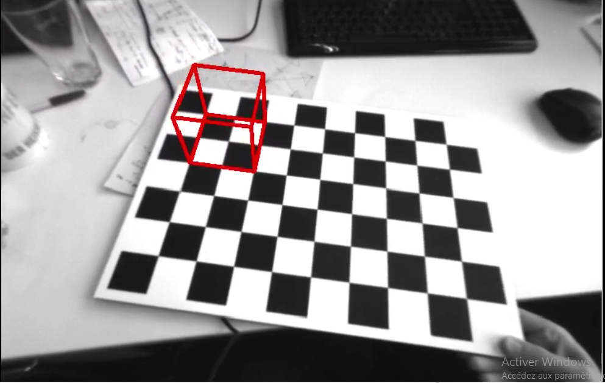

 <!-- .element height="50%" width="50%" -->
# Augmented reality wireframe cube
The goal of this exercise is to superimpose a virtual cube on a video of a planar grid viewed from diffeerent orientations using perspective projection, change of coordinate systems and lens distortion.
<!-- .element height="50%" width="50%" -->
# headings
